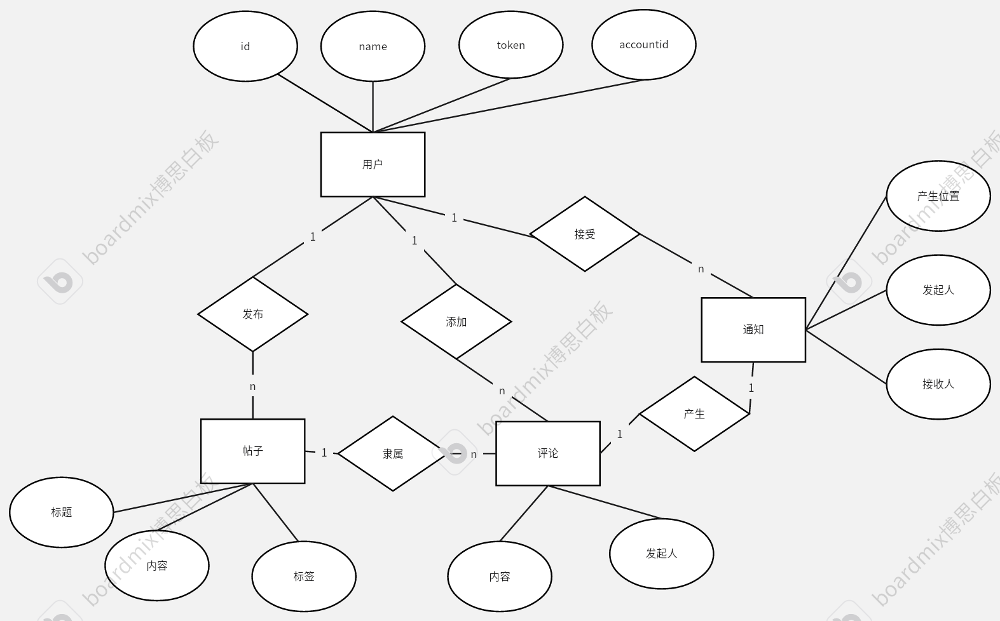

## 资源共享论坛

### 介绍
一个简单的论坛项目，使用github的api 进行登录，旨在帮助程序员们交流解惑，拓宽交流渠道

### 主要内容
用户登录  
文章上传   
评论  
通知

### 使用的工具
IDEA  
GitHubDesktop (用于管理代码版本)  
springboot (后端框架)  
bootstrap (前端框架)  
mysql   
myBatis-plus (持久层框架)  
lombok (注解插件，可以减少重复代码getter和setter)  
shrio (可能会加入，用于用户的权限管理)

### 使用的资料(补充中)
[sringboot文档](https://spring.io/guides)(springboot指导文档)  
[building oauthapps with git文档](https://docs.github.com/en/apps/oauth-apps/building-oauth-apps)(github登录)  
[bootstrap文档](https://v3.bootcss.com/getting-started/)(boot strap文档)  
[thymeleaf引擎文档](https://fanlychie.github.io/post/thymeleaf.html)  
[mybatis-plus文档](https://baomidou.com/introduce/)

### 项目结构/文件夹设计（补充中）
controller(页面控制)  
dto(与外部网站端口进行数据交换而定义的数据结构，用于传递向外部网站的参数)  
mapper(Dao层，用于定义与数据库交换数据的方法，也可以自定义sql)  
model(Entity层，用于定义映射数据库中表的实体类，@Table注解用于映射表)
provider(与外部网站进行交流的具体实现)

### 数据库设计(补充中)
user(用户表) {   
id (主键，用于标注用户序号)  
accountid (账户id)  
name (昵称)  
token (使用 github 登录 api 获取的 token，可以唯一标注用户)  
gmt_create (创建时间)   
gmt_modified (修改时间)  
bio(描述)
...........   
}  
sql脚本：  
create table user  
(  
id           int auto_increment   
primary key,   
account_id   varchar(100) ,   
name         varchar(50)  ,   
token        char(36)     null comment '登录的token',   
gmt_create   bigint       null comment '创建时间',   
gmt_modified bigint       ,   
bio          varchar(256)    
);

question(帖子表) {   
id  
title   (标题)  
description (描述)  
creator (创建人)  
comment_count (评论数)   
view_count (查看数)  
like_count (点赞数)  
tag(标签)  
gmt_create (创建时间)   
gmt_modified (修改时间)    
............  

}

comment(回复表){  
id  
parent_id  (父类对象，指明评论对象)  
type  (1/2级回复)  
commentator (评论人)  
like_count (点赞数)  
gmt_create (创建时间)   
gmt_modified (修改时间)  
id............  

}

notification(通知表){    
id  
notifier (通知发起人)  
receiver (接受消息的人)    
outerid (从哪里来帖子/回复的id)  
type (帖子还是回复)  
gmt_create (创建时间)  
status(是否已经读 0未读 1已经读)  
..............

}

###er图

